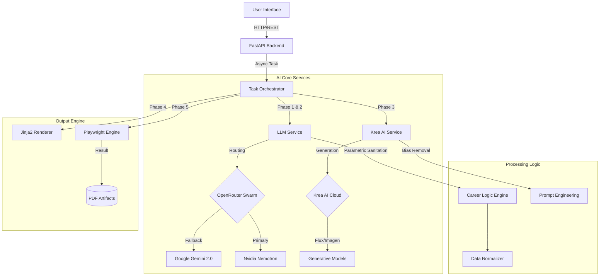

# AI CV Generator & Portfolio Suite
[](https://github.com/RaulJuliosIglesias)
[](https://www.python.org/)
[](https://reactjs.org/)
[](https://fastapi.tiangolo.com/)

> **A state-of-the-art, AI-powered system for generating hyper-realistic professional profiles, CVs, and avatars.**  
> Engineered with parametric collision logic, bias-removal engines, and multi-model AI orchestration.

---

## 👤 Author & Copyright

**Created by Raúl Iglesias Julio**

- 🐙 **GitHub**: [RaulJuliosIglesias](https://github.com/RaulJuliosIglesias)
- 💼 **LinkedIn**: [Raúl Iglesias Julio](https://www.linkedin.com/in/raul-iglesias-julio)
- 🌐 **Portfolio**: [Coming Soon](#)

---

## ⛔ License & Usage Rights

**STRICTLY PROPRIETARY. ALL RIGHTS RESERVED.**

This software is published for **portfolio and demonstration purposes only**.

- ❌ **NO Redistribution**: You may not mirror, distribute, or share this code.
- ❌ **NO Commercial Use**: You may not use this code for any commercial products.
- ❌ **NO Modification**: You may not modify or create derivative works.
- ✅ **View Only**: You are permitted to view this code to evaluate the technical skills of the author.

*Any unauthorized use, reproduction, or distribution of this software is strictly prohibited.*

---

## 🏗️ System Architecture

This project implements a robust **Event-Driven Microservices-like Architecture** (Monolithic repo) handling complex asynchronous workflows.



### Key Technical Components

#### 1. Backend (Python/FastAPI)
The core logic resides in a high-performance **FastAPI** application ensuring non-blocking operations via `asyncio`.
*   **Orchestration**: A custom `TaskManager` handles multi-stage generation jobs (Profiles -> CVs -> Images -> PDFs).
*   **Resilience**: Implements **Exponential Backoff** and **Circuit Breakers** for AI APIs. If a model like OpenRouter fails (404/429), the system automatically hot-swaps to a fallback model (Google Gemini) without user interruption.
*   **Data Validation**: Pydantic models ensure type safety across all Service layers.

#### 2. AI Services Layer
*   **LLM Service**: Agnostic integration with OpenRouter. Features a **Parametric Career Engine** that mathematically validates career history (e.g., ensuring a "VP" has a realistic past trajectory like "Director" -> "Manager", removing "Senior" prefixes from junior roles).
*   **Krea Service**: Advanced image generation wrapper supporting **Flux-1-Dev**, **Seedream-3**, and **Imagen-4**. Includes a custom **Anti-Bias Engine** that aggressively strips corporal/age biases ("office jackets", "senior" terms) to ensure modern, fresh avatars.

#### 3. Frontend (React/Vite)
A modern, reactive UI built with **React 18** and **Vite**.
*   **State Management**: **Zustand** for global efficient state (no Redux boilerplate).
*   **Real-time Feedback**: Polling mechanisms to track backend batch processing (0-100% progress).
*   **UI/UX**: Styled with **TailwindCSS** and **Radix UI** for a premium, accessible component library.

---

## 🛠️ Technology Stack

| Domain | Technology | Purpose |
|--------|------------|---------|
| **Core** | **Python 3.10+** | Logic & Orchestration |
| **API** | **FastAPI** | High-performance Async Web Server |
| **Frontend** | **React 18 + Vite** | Reactive Web Interface |
| **Styling** | **TailwindCSS** | Utility-first Design System |
| **AI (Text)** | **OpenRouter / Gemini** | LLM Profile & Content Generation |
| **AI (Image)** | **Krea AI API** | Photorealistic Profile Pictures |
| **Rendering** | **Playwright** | Headless Browser PDF Generation |
| **Templating** | **Jinja2** | Dynamic HTML Construction |
| **State** | **Zustand** | Frontend State Management |

---

## 🚀 Deep Dive: The Logic

### 1. Parametric Career Progression
Unlike basic generators that hallucinate random roles, this system enforces **Code-Based Career Logic**:
*   **Downgrade Algorithm**: If a profile is generated as an "Executive", the algorithm iterates backwards through history.
*   **Sanitization**: It actively strips titles. A "Senior Developer" in 2024 cannot have been a "Senior Developer" in 2018. The system strips "Senior" from past roles programmatically.

### 2. Bias-Free Image Generation
The `KreaService` implements a **Dynamic Context Injector**:
*   Detects roles (e.g., "Developer" vs "Creative").
*   **Forbidden Token Removal**: Strips "Senior", "Office", "Suit" from prompts.
*   **Style Injection**: Forces "Modern casual", "Tech aesthetic" contexts based on the persona, ensuring avatars look like real 2024 professionals, not stock photos.

---

## 📦 Installation & Setup

### Prerequisites
*   **Node.js** v18+
*   **Python** v3.10+
*   **API Keys** (OpenRouter, Krea AI)

### 1. Backend Setup
```bash
cd backend
python -m venv venv
# Windows
venv\Scripts\activate
# Linux/Mac
source venv/bin/activate

pip install -r requirements.txt
playwright install chromium

# Configuration
copy .env.example .env
# -> Edit .env with your KREA_API_KEY and OPENROUTER_API_KEY
```

### 2. Frontend Setup
```bash
cd frontend
npm install
npm run dev
```

### 3. Running
*   Frontend: `http://localhost:5173`
*   Backend Docs: `http://localhost:8000/docs`

---

## 🌟 Acknowledgements

Designed and developed by **Raúl Iglesias Julio** as a demonstration of advanced AI engineering capabilities.
