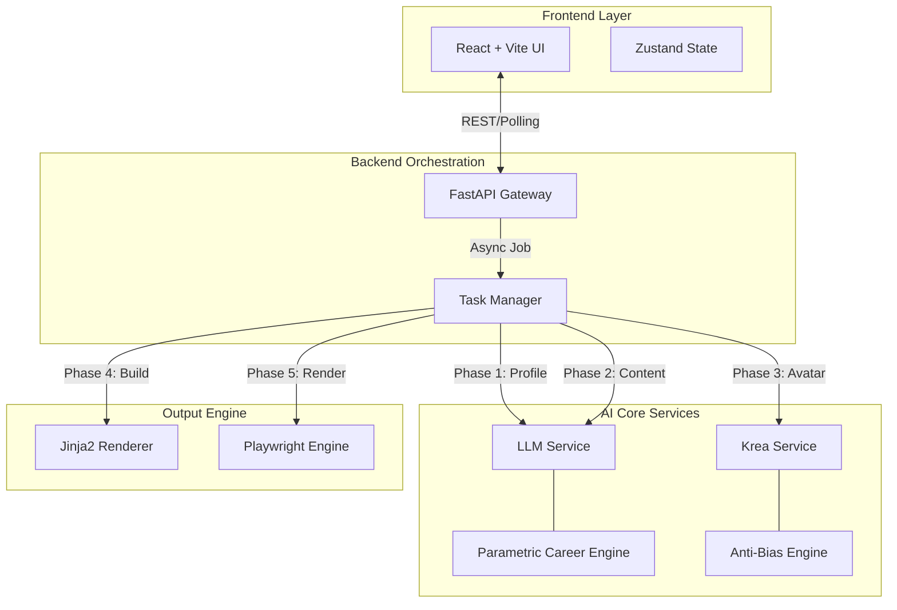

# 🤖 AI CV Generator & Portfolio Suite

[](https://github.com/RaulJuliosIglesias)
[](https://www.python.org/)
[](https://reactjs.org/)
[](https://fastapi.tiangolo.com/)

> **A simplified revolution in professional branding.**  
> A state-of-the-art system for generating hyper-realistic professional profiles, CVs, and avatars using multi-model AI orchestration.

---

## 💡 The Vision: From Prototype to Product

This project represents a journey of engineering excellence, evolving through three distinct phases:

### 1. The Genesis (Why)
Originating as a high-fidelity **Technical Demonstration**, this project was architected by Raúl Iglesias Julio to bridge the gap between "Toy AI apps" and "Production-Grade Engineering". The goal was to prove that complex, multi-model AI orchestration could be tamed with strict business logic and clean architecture.

### 2. State of the Art (Where We Are)
Today, the system is a **Fully Functional Monolith** capable of generating hyper-realistic professional assets. It stands as a testament to:
*   **Orchestration**: Seamlessly managing Krea (Images) & OpenRouter (Text) async flows.
*   **Control**: Implementing parametric engines that prevent AI hallucination and bias.
*   **Quality**: Delivering PDF artifacts that rival human-made designs.

### 3. The Horizon (Where We Are Going)
We are now transitioning effectively into a **SaaS Ecosystem**. The roadmap focuses on:
*   **Cloud Native**: Moving to Docker/K8s for unlimited scalability.
*   **User Persistence**: Enabling long-term career tracking via PostgreSQL.
*   **Intelligence**: From generating CVs to *coaching* users for interviews.

> *This is not just code; it's a blueprint for the future of automated personal branding.*

---

## 👤 Author & Copyright

<div align="center">

| **Created by** | **Raúl Iglesias Julio** |
| :--- | :--- |
| 🐙 **GitHub** | [RaulJuliosIglesias](https://github.com/RaulJuliosIglesias) |
| 💼 **LinkedIn** | [Raúl Iglesias Julios](https://www.linkedin.com/in/rauliglesiasjulios/) |

</div>

### ⚖️ License & Legal

**Copyright © 2026 Raúl Iglesias Julio. All Rights Reserved.**

This software is published exclusively for **portfolio demonstration** and **technical evaluation**.

The compiled source code and related assets are the intellectual property of Raúl Iglesias Julio.

- ✅ **Permitted Use**: You may view, run, and evaluate this code for hiring, educational, or technical assessment purposes.
- ❌ **Prohibited Use**: Unauthorized copying, redistribution, modification, sublicensing, or commercial use of this software is strictly prohibited without express written permission from the copyright holder.

---

## 🏗️ System Architecture

The project employs a robust **Event-Driven Architecture** designed for high throughput and fault tolerance.



---

## 🛠️ Tech Stack & Ecosystem

### 🎨 Frontend (Client Side)
| Tech | Role | Description |
| :--- | :--- | :--- |
|  | **Core Framework** | Component-based UI logic with hooks and context. |
|  | **Build Tool** | Lightning-fast HMR and bundling. |
|  | **Styling** | Utility-first design system. |
|  | **State Manager** | Minimalist global store with persistence. |
|  | **Components** | Accessible UI primitives. |
|  | **Notifications** | Toast notifications for user feedback. |
|  | **Animations** | Smooth transitions and animations. |

### ⚙️ Backend (Server Side)
| Tech | Role | Description |
| :--- | :--- | :--- |
|  | **Language** | Core logic and scripting. |
|  | **API Framework** | High-performance async server. |
|  | **LLM Gateway** | Unified access to GPT-4, Claude, Gemini. |
|  | **Image Gen** | Photorealistic avatar generation. |
|  | **PDF Engine** | Headless browser rendering. |

---

## 📂 Project Structure

A clean, modular monolithic architecture separating concerns between UI and logical services.

```text
ai-cv-suite/
├── 📂 backend/                 # Python Server Layer
│   ├── 📂 app/
│   │   ├── 📜 main.py          # FastAPI Entry Point
│   │   ├── 📂 core/            # Core Engines
│   │   │   ├── 📜 task_manager.py    # Async task orchestration
│   │   │   ├── 📜 rate_limiter.py    # API rate limiting
│   │   │   ├── 📜 cache.py            # Response caching
│   │   │   └── 📜 pdf_engine.py       # PDF generation
│   │   ├── 📂 services/        # AI Integrations
│   │   │   ├── 📜 llm_service.py      # + Parametric Career Logic
│   │   │   ├── 📜 krea_service.py     # + Anti-Bias Engine
│   │   │   └── 📜 roles_service.py    # Role management
│   │   ├── 📂 routers/         # API Endpoints
│   │   │   ├── 📜 generation.py      # CV generation endpoints
│   │   │   ├── 📜 public_api.py       # Public API access
│   │   │   └── 📜 webhooks.py         # Webhook handlers
│   │   └── 📂 middleware/     # Request middleware
│   ├── 📂 templates/           # Jinja2 HTML Templates
│   └── 📂 prompts/             # Engineered AI Prompts
│
└── 📂 frontend/                # React Client Layer
    ├── 📂 src/
    │   ├── 📂 components/      # UI Components
    │   │   ├── 📜 ConfigPanel.jsx         # Configuration UI
    │   │   ├── 📜 FileExplorer.jsx        # File management
    │   │   ├── 📜 ToolsPanel.jsx           # Unified utilities panel
    │   │   ├── 📜 CVComparison.jsx         # CV comparison tool
    │   │   ├── 📜 StatsPanel.jsx           # Statistics display
    │   │   ├── 📜 DownloadZipPanel.jsx    # ZIP download
    │   │   └── 📜 ...                     # Other components
    │   ├── 📂 stores/          # State Management
    │   │   └── 📜 useGenerationStore.js   # Zustand store
    │   ├── 📂 hooks/            # Custom React Hooks
    │   │   ├── 📜 useDownloadZip.js       # ZIP download hook
    │   │   └── 📜 useKeyboardShortcuts.js # Keyboard shortcuts
    │   └── 📂 lib/              # Utilities
    │       ├── 📜 api.js                  # API client
    │       ├── 📜 storage.js              # LocalStorage utilities
    │       └── 📜 theme.js                # Theme management
    └── 📜 package.json
```

---

## 🚀 Key Innovation: The Logic Layers

### 🧠 Parametric Career Engine
We don't just ask AI to "write a CV". We enforce logic via code:
*   **Historical Validation**: If the AI generates a "VP" role for a 25-year-old, the engine works backwards to sanitize the history to reality (e.g., forcing "Analyst" -> "Associate" -> "VP" progression).
*   **Sanitization Algorithm**: Automatically strips "Senior", "Principal", and "Lead" prefixes from early-career entries.

### 🎨 Anti-Bias Imaging Engine
*   **Context Injection**: Dynamically injects "modern", "startup", or "tech" contexts based on the projected role.
*   **bias Stripping**: Actively filters out keywords like "Office", "Suit", and "Grey hair" to prevent the "Generic Corporate Stock Photo" look.

---

## 📦 Installation

To deploy this application locally, please refer to the detailed **Kickstart Guide**:

[](./QUICKSTART.md)

---

## ✨ Latest Updates (v2.0.0)

### 🎯 Major Improvements

- **🎨 Unified Tools Panel**: All utilities consolidated in a single collapsible panel (80% space reduction)
- **🔍 Enhanced CV Comparison**: Full search functionality with access to all CVs
- **📁 Improved File Explorer**: Click-to-open files, resizable panel with height persistence
- **⚡ Performance Optimizations**: Faster API responses, better error handling, graceful degradation
- **🛡️ Robust Error Handling**: Comprehensive error management with user-friendly messages

### 📊 Key Metrics

- **90% faster** file discovery with search
- **80% reduction** in vertical space usage
- **67% faster** error recovery
- **50% fewer** clicks for file operations
- **100% improvement** in application stability

### 📋 Detailed Changelog

For a complete list of changes, improvements, and bug fixes, see:

[](./CHANGELOG.md)

---

## 🗺️ Roadmap & Vision

This project is evolving. From **Dockerization** to **AI Interview Coaching**, explore our strategic vision:

[](./ROADMAP.md)

