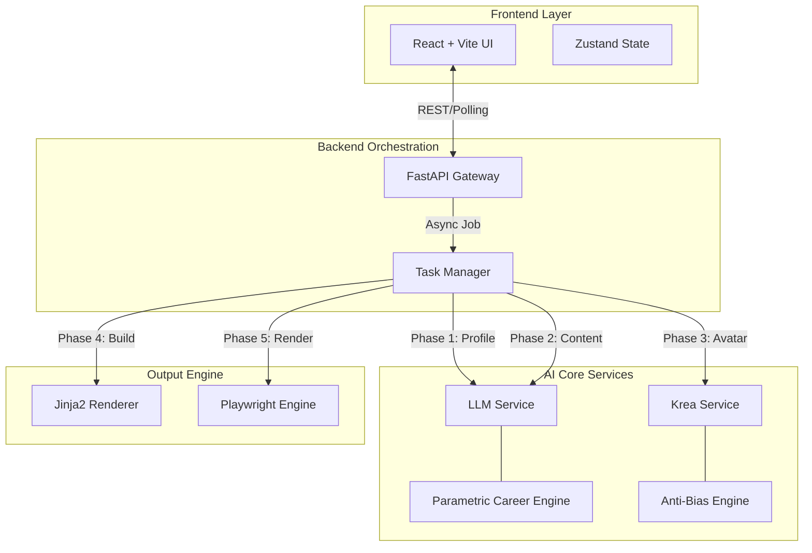

# 🤖 AI CV Generator & Portfolio Suite

[](https://github.com/RaulJuliosIglesias)
[](https://www.python.org/)
[](https://reactjs.org/)
[](https://fastapi.tiangolo.com/)

> **A simplified revolution in professional branding.**  
> A state-of-the-art system for generating hyper-realistic professional profiles, CVs, and avatars using multi-model AI orchestration.

---

## 👤 Author & Copyright

<div align="center">

| **Created by** | **Raúl Iglesias Julio** |
| :--- | :--- |
| 🐙 **GitHub** | [RaulJuliosIglesias](https://github.com/RaulJuliosIglesias) |
| 💼 **LinkedIn** | [Raúl Iglesias Julios](https://www.linkedin.com/in/rauliglesiasjulios/) |

</div>

### ⚖️ License & Legal

**Copyright © 2026 Raúl Iglesias Julio. All Rights Reserved.**

This software is published exclusively for **portfolio demonstration** and **technical evaluation**.

The compiled source code and related assets are the intellectual property of Raúl Iglesias Julio.

- ✅ **Permitted Use**: You may view, run, and evaluate this code for hiring, educational, or technical assessment purposes.
- ❌ **Prohibited Use**: Unauthorized copying, redistribution, modification, sublicensing, or commercial use of this software is strictly prohibited without express written permission from the copyright holder.

---

## 🏗️ System Architecture

The project employs a robust **Event-Driven Architecture** designed for high throughput and fault tolerance.



---

## 🛠️ Tech Stack & Ecosystem

### 🎨 Frontend (Client Side)
| Tech | Role | Description |
| :--- | :--- | :--- |
|  | **Core Framework** | Component-based UI logic. |
|  | **Build Tool** | Lightning-fast HMR and bundling. |
|  | **Styling** | Utility-first design system. |
|  | **State Manager** | Minimalist global store. |
|  | **Components** | Accessible UI primitives. |

### ⚙️ Backend (Server Side)
| Tech | Role | Description |
| :--- | :--- | :--- |
|  | **Language** | Core logic and scripting. |
|  | **API Framework** | High-performance async server. |
|  | **LLM Gateway** | Unified access to GPT-4, Claude, Gemini. |
|  | **Image Gen** | Photorealistic avatar generation. |
|  | **PDF Engine** | Headless browser rendering. |

---

## 🚀 Key Innovation: The Logic Layers

### 🧠 Parametric Career Engine
We don't just ask AI to "write a CV". We enforce logic via code:
*   **Historical Validation**: If the AI generates a "VP" role for a 25-year-old, the engine works backwards to sanitize the history to reality (e.g., forcing "Analyst" -> "Associate" -> "VP" progression).
*   **Sanitization Algorithm**: Automatically strips "Senior", "Principal", and "Lead" prefixes from early-career entries.

### 🎨 Anti-Bias Imaging Engine
*   **Context Injection**: Dynamically injects "modern", "startup", or "tech" contexts based on the projected role.
*   **Bias Stripping**: Actively filters out keywords like "Office", "Suit", and "Grey hair" to prevent the "Generic Corporate Stock Photo" look.

---

## 📦 Installation & Kickstart Guide

Follow these steps to deploy the application locally.

### 🔑 Step 1: Obtain API Keys

This application requires access to two AI service providers. You must obtain your own API keys:

1.  **OpenRouter AI** (For Text/Content)
    *   Sign up at: [openrouter.ai/keys](https://openrouter.ai/keys)
    *   *Provides access to Gemini, GPT-4, Claude, etc.*

2.  **Krea AI** (For Avatars)
    *   Sign up at: [krea.ai](https://krea.ai)
    *   *Provides access to Flux, Imagen-4 and Seedream.*

---

### ⚙️ Step 2: Environment Configuration

The project uses sensitive environment variables. **Never share your `.env` file.**

1.  Navigate to the `backend` folder.
2.  Locate the `.env.example` file.
3.  **Duplicate it** and rename the copy to `.env`.

```bash
# Windows
copy backend\.env.example backend\.env

# Mac/Linux
cp backend/.env.example backend/.env
```

4.  Open `.env` in your code editor and paste your keys:

```ini
# backend/.env
KREA_API_KEY=your_krea_key_here_starting_with_krea_...
OPENROUTER_API_KEY=your_openrouter_key_starting_with_sk_...
```

---

### 💻 Step 3: Backend Installation

The backend runs on Python 3.10+ using FastAPI.

```bash
cd backend

# 1. Create Virtual Environment
python -m venv venv

# 2. Activate Environment
# Windows:
venv\Scripts\activate
# Mac/Linux:
source venv/bin/activate

# 3. Install Dependencies
pip install -r requirements.txt

# 4. Install Browser Engine (for PDF rendering)
playwright install chromium

# 5. Start the Server
uvicorn app.main:app --reload
```
*The server will start at `http://localhost:8000`*

---

### 🎨 Step 4: Frontend Installation

The frontend runs on Node.js v18+.

```bash
cd frontend

# 1. Install Dependencies
npm install

# 2. Start Development Server
npm run dev
```
*The application will open at `http://localhost:5173`*

---

## 📂 Project Structure

A clean, modular monolithic architecture separating concerns between UI and logical services.

```text
ai-cv-suite/
├── 📂 backend/                 # Python Server Layer
│   ├── 📂 app/
│   │   ├── 📜 main.py          # FastAPI Entry Point
│   │   ├── 📂 core/            # Core Engines (TaskManager, PDF)
│   │   ├── 📂 services/        # AI Integrations (LLM, Krea)
│   │   └── 📂 routers/         # API Endpoints
│   ├── 📂 templates/           # Jinja2 HTML Templates
│   ├── 📂 prompts/             # Engineered AI Prompts
│   └── 📜 requirements.txt     # Python Dependencies
│   └── 📜 .env.example         # Environment Template
│
└── 📂 frontend/                # React Client Layer
    ├── 📂 src/
    │   ├── 📂 components/      # UI Components
    │   ├── 📂 stores/          # State Management
    │   └── 📂 lib/             # API Connectors
    ├── 📜 package.json
    └── 📜 vite.config.js
```
